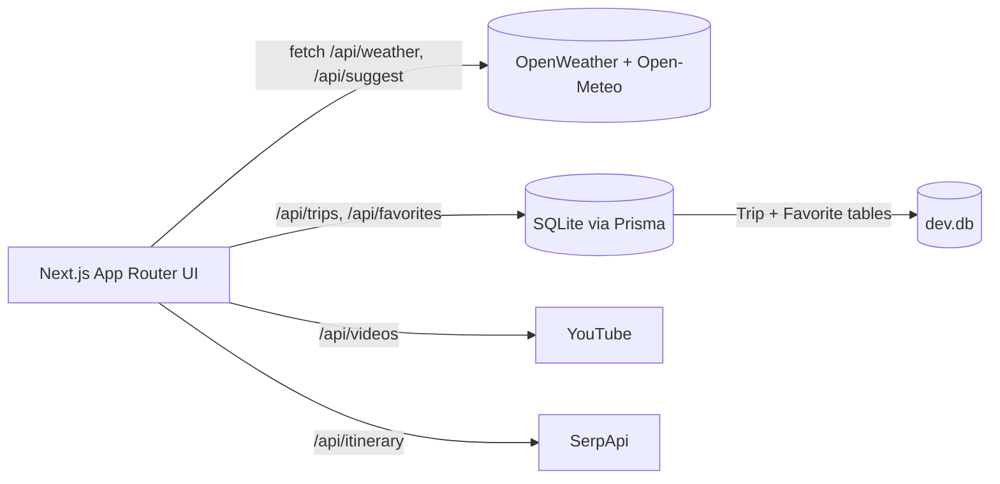

# weather-trip-planner

## Overview
Plan routes with confidence by combining intelligent location parsing, live weather, map previews, and persistent trip/favorite records. The app satisfies Weather App Assessments 1 & 2: instant forecasts, CRUD-backed storage, validation, alerts, and export hooks.

## Features
- Intelligent input parser detects cities, postal codes, GPS coordinates, or landmarks and shows an interpreted badge before searching.
- Auto-suggest dropdown (Open-Meteo geocoding + Fuse.js) gives curated matches as you type; clicking a suggestion jumps the map and forecast instantly.
- Weather overlay includes current conditions, emoji-rich 5-day/14-day toggle, map-first popup chips, and reusable Trip save flow.
- Browser geolocation fallback, map tapping, and favorites hover previews keep the Leaflet view in sync at all times.
- SQLite + Prisma back trip CRUD plus a dedicated favorites table; every creation validates dates/locations and stores normalized metadata + weather JSON/alerts.
- Offline cache stores the last successful weather payload, surfaces "Last known data" banners, and rehydrates the dashboard if you go offline.
- Supporting APIs: OpenWeather (current/forecast/alerts), Open-Meteo (14-day + geocoding), YouTube Data (travel videos), and SerpApi (Google itinerary summaries).

## Tech Stack
- **Frontend**: Next.js (App Router), React 18, CSS modules/global tokens, react-leaflet + Leaflet tiles.
- **Backend**: Next.js route handlers, Prisma ORM, SQLite database.
- **Integrations**: OpenWeather REST, Open-Meteo forecast/geocode, YouTube Data API, SerpApi Google Search, OpenStreetMap tiles.
- **Tooling**: Fuse.js for ranking suggestions, Algolia client placeholder (future index), ESLint/Next lint scripts.

## Requirements Coverage

| Area | Status |
| --- | --- |
| Location inputs (city/ZIP/coords/landmark) | ✅ Single smart field + auto-detect + interpreted badge |
| Current weather + display | ✅ OpenWeather current conditions card with emoji + metrics |
| 5-day / 14-day forecast | ✅ Toggle between OpenWeather 5-day slices and Open-Meteo 14-day daily data |
| "Use my location" + map UI | ✅ Geolocation fallback, tap-to-search map, popup chips |
| CRUD trips (create/read/update/delete) | ✅ Prisma-backed API routes, validations, and UI |
| Weather validation + persistence | ✅ Geocoding ensures real place, weather JSON stored per trip |
| Favorites + alerts + offline cache | ✅ Favorites table/UX, OpenWeather alerts badge, localStorage snapshot |
| Extra APIs (videos + itinerary) | ✅ YouTube recommendations + SerpApi-powered itinerary copy |
| Data export | ✅ JSON/CSV export route for saved trips |

## Architecture
- `src/app` — App Router layouts/pages plus API route handlers (weather, trips, favorites, export, videos, itinerary, suggest)
- `src/components` — SearchBar, Map, cards, TripForm, TravelVideos, ItineraryPreview, HotelSuggestions, etc.
- `src/lib` — Prisma client singleton, weather client (OpenWeather + Open-Meteo), weather emoji helpers, validation/input parsing, YouTube/SerpApi helpers.
- `prisma` — SQLite schema + migrations.

### Diagram

## Setup
1. Install dependencies: `npm install`
2. Copy `.env.example` -> `.env` and add the required API keys.
3. Apply the Prisma schema: `npx prisma migrate dev` (creates/updates `dev.db` and favorites table).
4. Start the dev server: `npm run dev`

## Environment Variables
See `.env.example` for the latest list. Required keys:

| Variable | Purpose |
| --- | --- |
| `DATABASE_URL` | SQLite connection string (default `file:./dev.db`) |
| `OPENWEATHER_API_KEY` | OpenWeather current/forecast/alerts |
| `YOUTUBE_API_KEY` | Travel video suggestions |
| `SERPAPI_API_KEY` | Google itinerary search via SerpApi |

## Scripts
`npm run dev`, `npm run build`, `npm run start`, `npm run lint`, `npm run prisma:generate`, `npm run prisma:migrate`.

## Future Improvements
- Algolia Places index for even richer auto-complete and analytics.
- PWA/offline mode for trips + map tiles, plus push notifications for severe alerts.
- Shared itineraries, collaborative editing, and per-user auth.